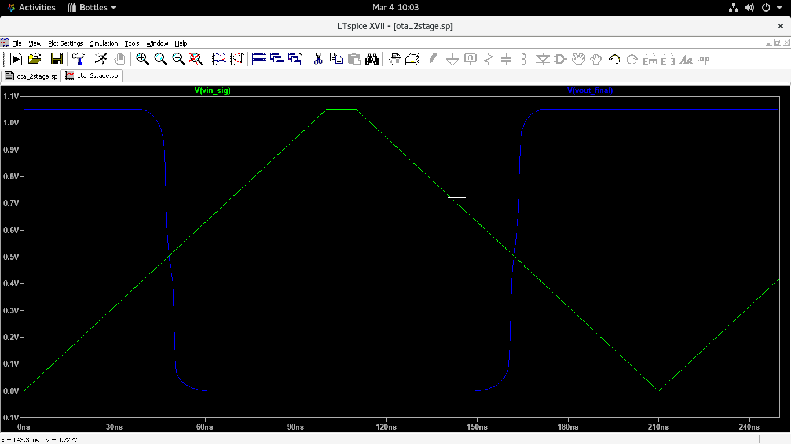
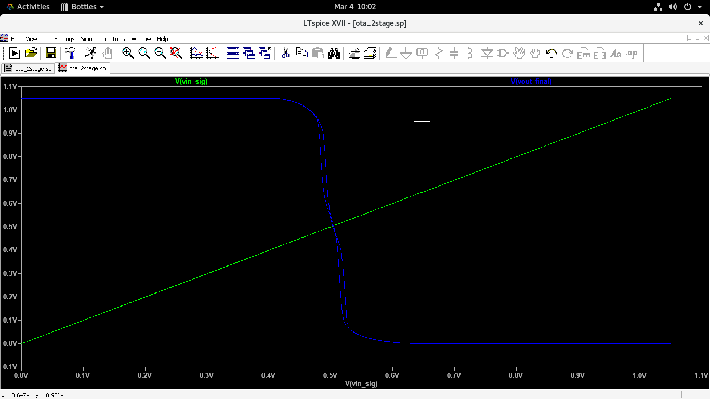
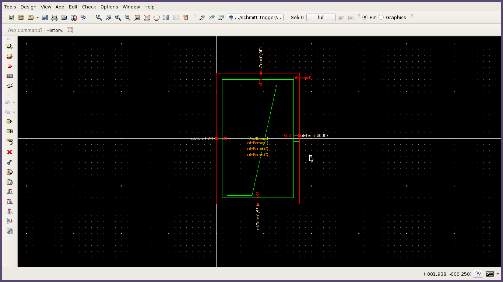
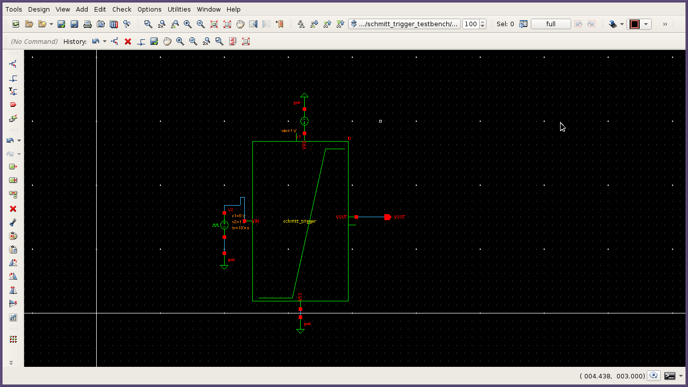

# CMOS Schmitt Trigger Design and Characterization

This repository contains the design, simulation, and characterization of a **CMOS Schmitt Trigger**. The design flow involves schematic capture and netlist generation in **Synopsys Custom Compiler**, followed by full electrical characterization in **LTspice**.

## Table of Contents
* [Introduction](#introduction)
* [Circuit Design](#circuit-design)
* [Simulation Environment](#simulation-environment)
* [Characterization Results](#characterization-results)
* [Visual Verification](#visual-verification)
* [Log and Error Analysis](#log-and-error-analysis)
* [How to Reproduce](#how-to-run)
* [Author](#author)

---

## Introduction
A Schmitt Trigger is a dual-threshold comparator circuit that uses positive feedback to implement hysteresis. It is a fundamental building block in VLSI systems used for noise suppression, wave-shaping, and preventing multiple output transitions from slow or noisy input signals.

## Circuit Design
The design utilizes a standard 6-transistor CMOS configuration. The switching thresholds ($V_{TH+}$ and $V_{TH-}$) are determined by the ratio of the PMOS and NMOS device widths, specifically the feedback transistors.

* **Process Node:** Generic 105nm (Level 1 Models)
* **Supply Voltage ($V_{DD}$):** 1.05V
* **Transistor Sizes:** $W=0.1\mu m, L=0.03\mu m$


## Simulation Environment
The project was verified using **LTspice**. The raw netlist exported from Synopsys Custom Compiler was adapted to use generic Level 1 models to ensure tool interoperability and open-source accessibility.

### Tools Used
* **Design:** Synopsys Custom Compiler
* **Simulation:** LTspice XVII
* **Platform:** AlmaLinux (RHEL-based)

## Characterization Results
The circuit was characterized using a triangle wave input to observe both rising and falling transition points across the full supply range.

| Parameter | Value | Status |
| :--- | :--- | :--- |
| **$V_{TH+}$ (Rising Threshold)** | **~0.78 V** | Verified |
| **$V_{TH-}$ (Falling Threshold)** | **~0.47 V** | Verified |
| **$V_{H}$ (Hysteresis Width)** | **~0.31 V** | Calculated |
| **Average Power** | **~201.5 nW** | Verified |

## Visual Verification

### 1. Transient Waveform (Time Domain)
The transient analysis shows the output (`vout_final`) "snapping" high or low only after the input (`vin_sig`) crosses the defined thresholds. This confirms the time-domain stability of the design.



### 2. Hysteresis Loop (VTC)
The Voltage Transfer Characteristic (VTC) curve plotted as $V_{out}$ vs $V_{in}$ illustrates the distinct hysteresis window and noise margin.



### 3. Circuit Symbol and Setup
| Logic Symbol | Simulation Testbench |
| :---: | :---: |
|  |  |

## Log and Error Analysis
The following numerical data was extracted from the Spice Error Log after transient analysis:

```text
vth_plus: v(vout_final)=0.525 AT 4.78357e-008
avg_power: AVG(i(v_vdd)*v(vdd!))=-2.01495e-007
